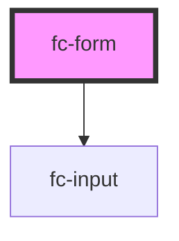

# fc-form

<!-- Auto Generated Below -->

## Properties

| Property | Attribute | Description | Type        | Default     |
| -------- | --------- | ----------- | ----------- | ----------- |
| `form`   | --        |             | `IFormData` | `undefined` |

## Dependencies

### Depends on

- [fc-input](../fc-input)

### Graph

----------------------------------------------

*Built with [StencilJS](https://stenciljs.com/)*
