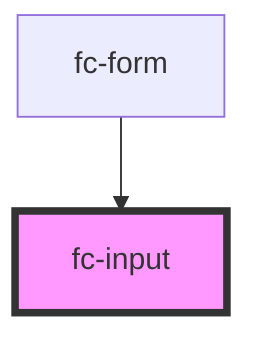

# fc-input

<!-- Auto Generated Below -->

## Properties

| Property      | Attribute     | Description | Type                 | Default                        |
| ------------- | ------------- | ----------- | -------------------- | ------------------------------ |
| `disabled`    | `disabled`    |             | `boolean`            | `false`                        |
| `label`       | `label`       |             | `string`             | `"Please enter you name"`      |
| `placeholder` | `placeholder` |             | `string`             | `"Please fill here your name"` |
| `type`        | `type`        |             | `"number" \| "text"` | `"text"`                       |

## Events

| Event         | Description | Type                                     |
| ------------- | ----------- | ---------------------------------------- |
| `inputChange` |             | `CustomEvent<{ [label: string]: any; }>` |

## Dependencies

### Used by

 - [fc-form](../fc-form)

### Graph

----------------------------------------------

*Built with [StencilJS](https://stenciljs.com/)*
